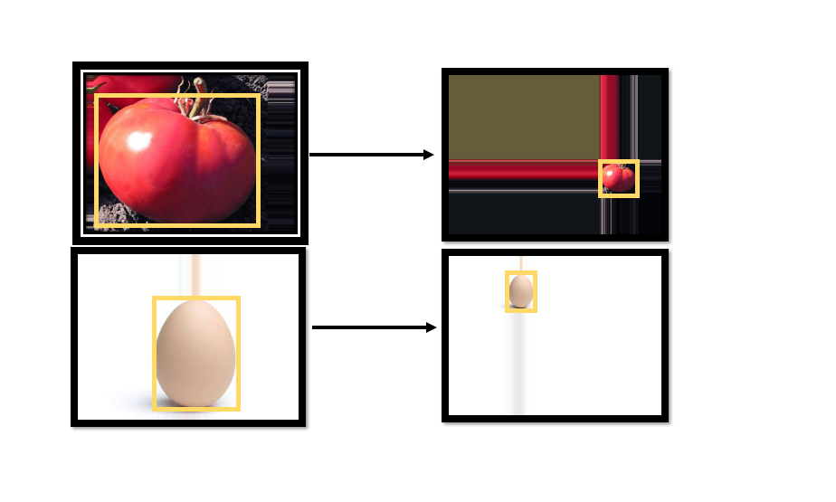

# Smart-Fridge

### First: we check (Height < width) ?
* If the height is bigger we rotate the image by 90 degree, otherwise do nothing.
We do this because our final destiny it to fit the image in height 480 and width 640
With minimum lost data.

### Second: we check ( x ? y) ?
* X - The difference between the original width of the image and the wanted.
Y -  The same difference but of the height.
Here we are looking for the smallest difference because this value we will use for
scaling the image.
The scale value is blocked from above with the value 2, its mean that we never
scale the image more then in 2 times no matter what is the value 
(to prevent lost data).
If the image is bigger then the wanted we scale down by the biggest difference.

### Third: after we scaled the image we are doing padding so the image will fit the 
* Desired Height and width (480,640) .
We pad the image randomly from all the sides because we don’t want to have 
all images to be with the same boxing location (for example we don’t want 
all boxing to be in the down right sight).

### Final result: 
* all the pixels that are out of the yellow frame were created with
 random padding.
 

### Next we resize the object inside the image:
Each object has his standard size, this size was tested with 60 cm distance between the object and the camera eye.

### We bullied algorithm that resize automatically all the object inside the image:
* First we check if the object is bigger then the wanted size?
If yes we check how much its bigger  then the wanted size  and then we resize the image and give it padding to get back the wanted size (640,480) see the example: 

