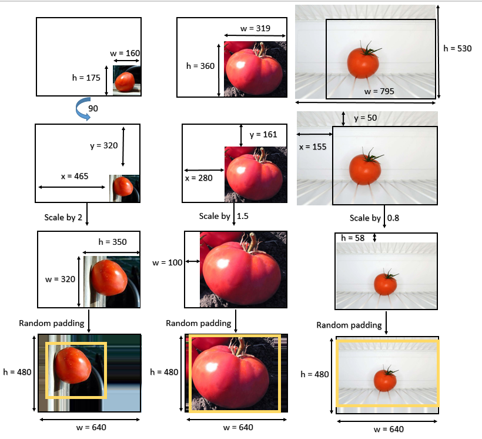

# Smart-Fridge





## Table of contents
* [General info](#general-info)
* [Technologies](#technologies)
* [Setup](#setup)

## General info
This project is simple Lorem ipsum dolor generator.
	
## Technologies
Project is created with:
##First: we check (Height < width) ?
* If the height is bigger we rotate the image by 90 degree, otherwise do nothing.
We do this because our final destiny it to fit the image in height 480 and width 640
With minimum lost data.

* Ipsum version: 2.33
* Ament library version: 999
	
## Setup
To run this project, install it locally using npm:

```
$ cd ../lorem
$ npm install
$ npm start
```


